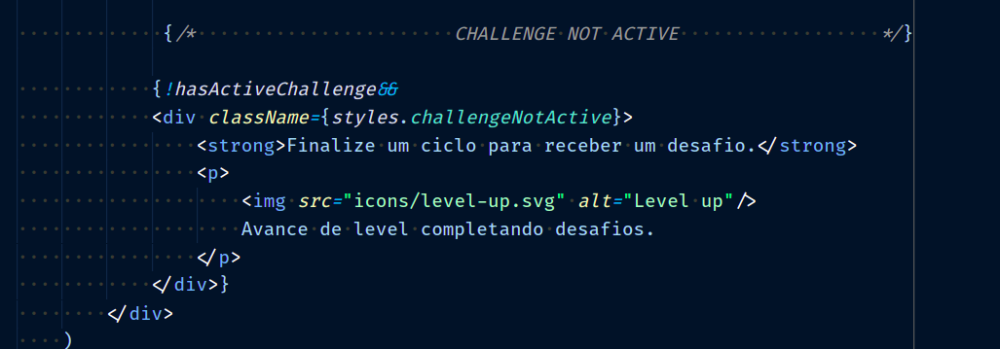
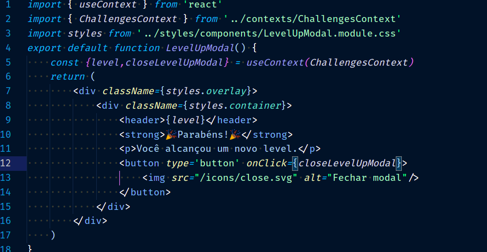

# NLW4 Moveit

<h1>Aula 1</h1>
<h2>Introdução</h2>

Moveit é um aplicativo que tem como estratégia fazer com que você não fique parado por muito tempo.
A tecnica de Pomodoro diz que a cada 25 minutos se deveria dar uma pausa pequena de 5 minutos para ter melhor desempenho, o que está totalmente alinhado com a proposta do Moveit!

Nesta documentação vou escrevendo os aprendzados e impressões de cada aula , assim como mostrar exemplos de cada nova funcionabilidade. Assim, conseguirei ter um material de consulta para projetos futuros e disponibilizarei esse repositório como público para que outros devs possam utilizá-lo para consulta também.

<h2>Fluxo de uma API</h2>

<h2>Criando projeto React</h2>
<ul>
<li>
Comando para criar um projeto react pelo <strong>YARN</strong> e com <strong>TYPESCRIPT</strong> é :  
</li>
 

<strong>yarn create react-app NomeDoProjeto --template=typescript</strong>

<li>
Comando para criar um projeto react pelo <strong>NPM</strong> e com <strong>TYPESCRIPT</strong> é :  
</li>
 

<strong>npx create-react-app NomeDoProjeto --template=typescript</strong>

</ul>
<h3>Rodando projeto React</h3>
<ul>
<li>
Comando para rodar projeto react pelo <strong>YARN</strong> é :  
</li>
 

<strong>yarn start</strong>

<li>
Comando para rodar projeto react pelo <strong>NPM</strong> é :  
</li>
 

<strong>npm start</strong>

</ul>
<h3>Como react funciona?</h3>

Uma vez carregado o basico da pagina pelo HTML o React pega os dados e criar outros componentes HTML utiizando <strong>Javascript</strong>. A sintaxe de se utilizar um componente JS parecendo um HTML é o <strong>JSX</strong>.

<h2>Componentes</h2>

São as "Tags HTML" do react. Com  elas por meio do REACT DOM o react consegue criar componentes HTML.Pode se dizer que tudo no react são componentes. Para se criar um componente, deve-se criar uma função e exporta-la como default de seu arquivo. Reutilize os componentes em vários lugares, isso ajuda muito em manutenção e para diminuir a quantidade de codigo da aplicação.

<h3>Propriedades(Props)</h3>

São as caracteristicas de cada componente que podem ser enviadas do componente pai. São passadas via parametro na função como mostram as imagens abaixo.

<h3>Children</h3>

Declaração de props default do react que surge quando se passa um parâmetro dentro de um componente. Por padrão , quando isso ocorre se pode pegar esses parâmetros dentro de <strong>props.children</strong>.

<h2>Estado</h2>

É a "memória" de um componente. É necessário utilizar estado quando um componente precisa guardar dados e propriedades dinâmicas sobre si mesmo. 

<h3>Manipular estado(HOOKS)</h3>
<h4>useState</h4>

É o como fazemos para mudar o estado de um componente. No exemplo abaixo fizemos um contador e uma função que utiliza do useState para atualizar o valor de counter. Caso haja mais de uma propriedade que se deseja mudar, pode-se utilizar um objeto no lugar do numero  counter e colocar varias propriedades modificando somente as propriedades desse objeto que se deseja.

<h2>Fontes</h2>

Para utilizar fontes do goolge entramos no site de google fonts e procuramos pelas fontes Inter de tamanho 400, 500 e 600 e a fonte Rajdhani de tamanho 600. Uma vez adicionados pegamos o link gerado na pagina e colamos em index.html.

<h2>CSS global</h2>

Criamos uma pasta chamada styles e dentro um arquivo css onde setamos alguns parametros globais para nossa aplicação. Dentre eles estava que todos os componentes teriam margem e padding 0 por default e que a cor de fundo do nosso body seria #f2f3f5

<h2>Responsividade</h2>

para responsividade, setamos o padrão da fonte da nossa aplicação para 1rem (16 px por padrão), e colocamos alguns  @media para que quando nossas telas diminuam de tamanho, as fontes se adaptem diminuindo 1px. Se utilizamos rem como medida, quando o tamanho da tela diminui , todos os componentes diminuem junto, fazendo assim, com que nosso app seja extremamente responsivo.

<h2>Experience Bar</h2>

Criamos o experience bar utilizando css e o componente da experience bar.

<h1>Aula 2</h1>
<h2>Next</h2>
<h3>O que é?</h3>

Nextjs é um framework em cima do react que facilita o uso do mesmo. Habilita trabalhar com <strong>SSR</strong>, <strong>SPA</strong> e <strong>SSG</strong>. O next gera um servidor node numa camada intermediária entre o nosso backend e o usuário, interpretando e gerando os arquivos html e css nele antes de enviar para o cliente. Com isso resolvemos varios problemas de SEO(system engine optmization) que aconteciam quando crawlers tentavam acessar um site que somente era gerado em Javascript e não conseguiam por não entenderem Javascript. O nome dessa solução que o next proporciona é <strong>SSR</strong>, ou server side rendering.

<h3>SSR(server side rendering)</h3>

<h3>SPA(single page application)</h3>

Em uma SPA toda a interface é construida no frontend. Mantemos algumas coisas na aplicação e mudamos somente o diferencial de uma tela para outra pegando dados do backend e reconstruindo os componentes.O react tradicional (sem o nextjs) utiliza o SPA.

<h3>SSG(static site generation)</h3>

Este modelo é um dos pioneiros de quando se trabalhavam em sites. Ele consiste em fornecer um arquivo HTML , um CSS e outro JS puro, sem alterações por dados do backend. Porém com o surgimento do next podemos gerar arquivos puros e estáticos, mas que se atualizam de tempos em tempos disponibilizando uma versão estatica mais atualizada para ser distribuida.

<h2>Criando projeto NEXT</h2>
<ul>
<li>
Comando para criar um projeto next pelo <strong>YARN</strong> é :  
</li>
 

<strong>yarn create next-app NomeDoProjeto</strong>

<li>
Comando para criar um projeto next pelo <strong>NPM</strong> é :  
</li>
 

<strong>npx create-next-app NomeDoProjeto</strong>

</ul>
<h3>Migramos nosso projeto para NEXT</h3>

Após rodarmos nosso comando de criar um projeto next, copiamos e colamos todos os arquivos criados na aula 1 para nosso mais recente projeto "moveit-next".

<h3>_app.js</h3>

Arquivo em comum entre todas as páginas. Tudo que estiver declarado dentro dele não irá mudar ao navegar de uma pagina para outra.

<h3>Instalar typescript no Next com YARN</h3>
<ul>
<li>

1 Trocar extensão .js do arquivo index.js e _app.js para index.tsx e _app.tsx

</li>
<li>

2 rodar comando para instalar typescript

</li>

<strong>yarn add typescript @types/react @types/react-dom @types/node -D</strong>

<li>

3 comando para rodar a aplicação

</li>

<strong>Yarn dev</strong>

</ul>
<h3>Declarar fontes no NextJS</h3>

<h3>CSS modules</h3>

<h2>Mudar ícone e título da aba no browser</h2>

<h2>Componentes criados no Final da aula</h2>
<h3>Profile</h3>

<h3>Compelated Challenges</h3>

<h3>CountDown</h3>

ContDown foi o ultimo componetne da aula 2, nele trabalhamos com estado criando um contador como mostra abaixo.

A logica para o contador foi utilizando hooks como mostra abaixo

<h1>Aula 3</h1>
<h3>Como declarar duas classes CSS no react</h3>

<h2>Logica restante e componentes com condicional para exibição</h2>

<h3>Challenge Box</h3>
<h3>Desafio ativo</h3>

<h3>Desafio não ativo</h3>

<h2>Abordagens interessantes em CSS</h2>
<h3>Repeat em grid</h3>

Utilizado para criar um espaçamento em colunas iguais repetidamente

<h3>Filter para opacidade</h3>

Utilizado filter para diminuir a opacidade de um componente em 10% com hover

<h2>Context API</h2>
<h3>Declarar contexto</h3>

Consiste na forma de se fazer a comunicação de um componente isolado para outro. Para isso , precisamos criar um contexto em um arquivo separado como mostra abaixo. Context API é um meio muito útil de resolver a maioria dos problemas que precisariam de REDUX.

<h3>Disponibilizar contexto globalmente</h3>

Para disponibilizar o contexto criado acima, precisamos embrulha-lo em nosso _app.tsx para que ele esteja disponivel em toda aplicação.

<h3>Pegar context em um componente</h3>

Por fim agora para podermos acessar os dados do contexto precisamos importar o <strong>useContext</strong> e utilizalo para atribuir seu valor em uma variável.

<h3>Tipar contexto</h3>

Para que possamos ter acesso aos tipos de dados de um determinado contexto, podemos tipar seu retorno como mostrado abaixo.

<h1>Aula 4</h1>
<h2>CountDown context</h2>

Nesta aula, finalizamos as funcionabilidades que faltavam para passar de nível ao finalizar uma tarefa, porém, ainda não conseguimos fazer com que o botão de contador resete uma vez que se compelta uma tarefa. Por isso, decidimos passar as funções do contador para uma CONTEXT API assim como o contexto de desafios.

Como esse contexto não era utilizado pela aplicação como um todo, e sim mais nos componentes de CountDown e de ChallengeBox, decidimos por embrulhar somente a section da pagina de home nesse contexto como mostrado abaixo.

<h2>Web Notification</h2>
<h3>Pedir permissão</h3>

Para enviar notificações para o usuário, primeiro precisamos pedir permissão.

Para mostrar notificação.

<h3>Audio</h3>

<h1>Aula 5</h1>
<h2>Storage</h2>
<h3>Local Storage</h3>

Storage baseado em <strong>chave e valor e em texto</strong>. Esse storage se mantém mesmo após dar refresh na página.

<h3>Session Storage</h3>

Storage similar ao Local storage, porém <strong>perde seus dados ao finalizar a sessão</strong>(fechar browser ou reiniciar o pc).

<h3>IndexDB e webSQL</h3>

Storages locais similares a um SQLite.

<h3>Cookies</h3>

Uma das formas mais antigas de se armazenar dados, muito similar ao localStorage, com algumas funcionabilidades a mais. Dentre elas existem as de salvar  informações para um domínio apenas, a de informar quando essa informação expira e a de limitar para httpOnly ou secure(https only).

<h2>Adicionando cookies</h2>
<ul>
<li>
Comando para adicionar a biblioteca de cookies pelo <strong>YARN</strong> é :  
</li>
 

<strong>yarn add js-cookie</strong>

<li>
Comando para adicionar a biblioteca de cookies pelo <strong>NPM</strong> é :  
</li>
 

<strong>npm i js-cookie</strong>

</ul>
<h3>DefinitelyTyped</h3>

Quando uma biblioteca não vem com a tipagem do typescript, geralmente procuramos dentro do repositório <strong>definitelyTyped</strong> uma especie de plugin que disponibilize as tipagens.

<ul>
<li>
Comando para adicionar a biblioteca de types pelo <strong>YARN</strong> é :  
</li>
 

<strong>yarn add @types/js-cookie -D</strong>

<li>
Comando para adicionar a biblioteca de types pelo <strong>NPM</strong> é :  
</li>
 

<strong>npm i @types/js-cookie -D</strong>

</ul>
<h2>GetServerSideProps</h2>

Para conseguirmos carregar informações da pagina, vamos utilizar de uma ferramenta do next chamada <strong>GetServerSideProps</strong>. Essa função torna aquela página uma página de <strong>SSR</strong>, fazendo assim, com que todo dentro dessa função seja feita no lado do servidor e entregue como propriedades da página.

<h3>Recebendo as props</h3>

<h3>Setando as props no context</h3>

<h2>LevelUp Modal</h2>

<h2>Deploy</h2>

Por fim, para darmos deploy em nossa aplicação utilizamos a <strong>Vercel</strong>. A vercel é a empresa criadora do Next e por isso possui muitos facilitadores para esse framework.

<h3>Adicionar Vercel CLI</h3>
<ul>
<li>
Comando para adicionar a Vercel CLI é :  
</li>
 

<strong>npm i -g vercel</strong>

</ul>
<h3>Login</h3>

Uma vez criada sua conta no site da Vercel, digite o seguinte comando abaixo e verifique seu email para poder subir sua aplicação.

<ul>
<li>
Comando para fazer loguin na Vercel CLI :  
</li>
 

<strong>vercel login</strong>

</ul>
<h3>Deploy pelo CLI</h3>

Após terminar todos os passos acima, é só entrar na pasta de seu projeto e rodar o comando:

<ul>
<li>
Comando para fazer deploy pela primeira vez:  
</li>
 

<strong>vercel</strong>

</ul>
<h3>Deploy em produção</h3>

Uma vez que seu app esteja em produção, quando você subir novamente sua aplicação, a Vercel  cuidará para que enquanto uma aplicação executa o build, a outra se mantenha no ar sem atrapalhar a interação com o usuário final.

<ul>
<li>
Comando para fazer deploy em produção:  
</li>
 

<strong>vercel --prod</strong>

</ul>
<h2>Considerações finais do curso</h2>

Gostei muito da dinâmica do curso, com bastante prática e vários exemplos de funcionabilidades e tecnologias novas do mercado. Acredito que com essa pequena apostila em forma de documentação qualquer um poderá se aprofundar, mesmo que um pouco na "stack React Next". Recomendo a todos que puderem participar de futuros eventos que o façam. O contato com a comunidade e a troca de conhecimentos geradas no NLW são experiências únicas.

