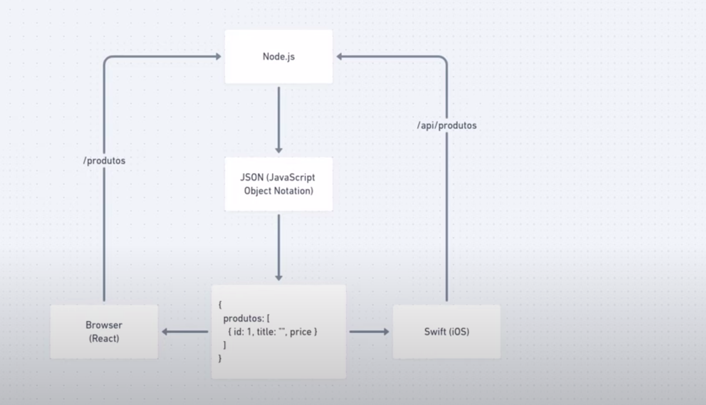
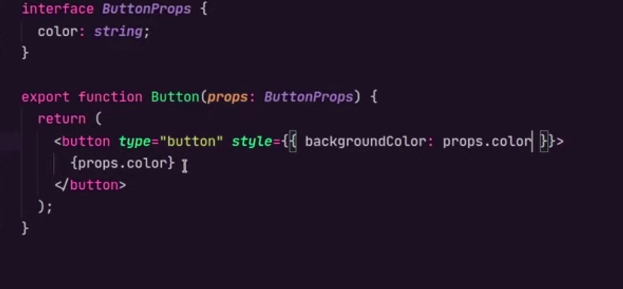
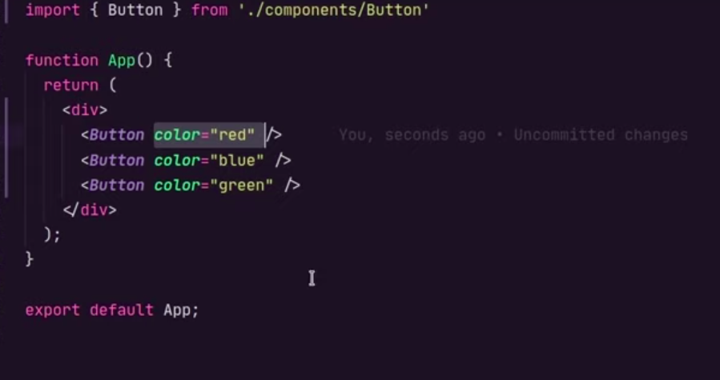
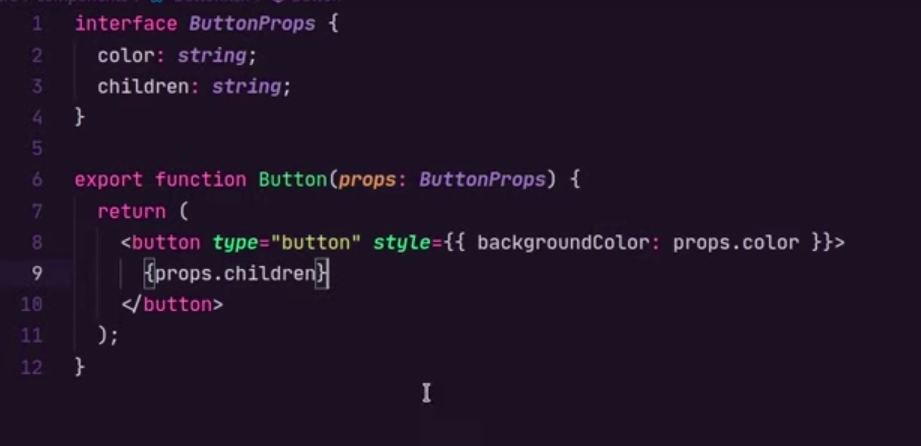
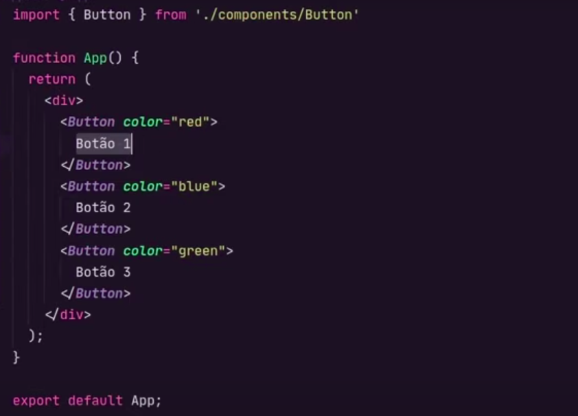
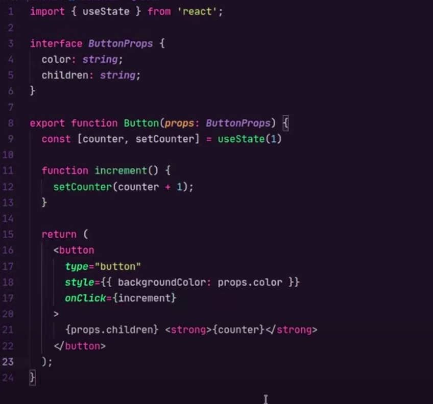
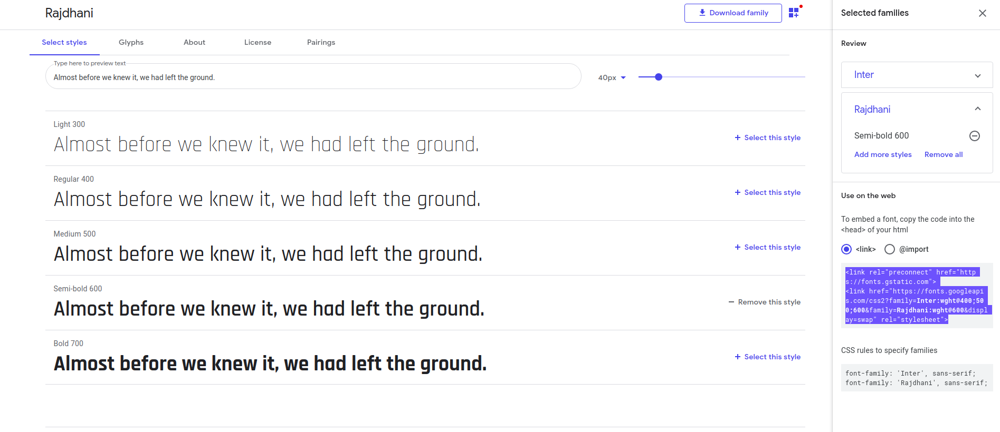
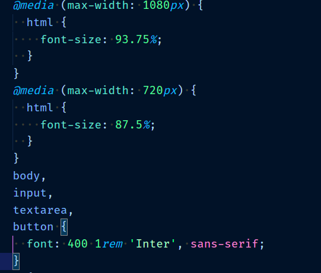
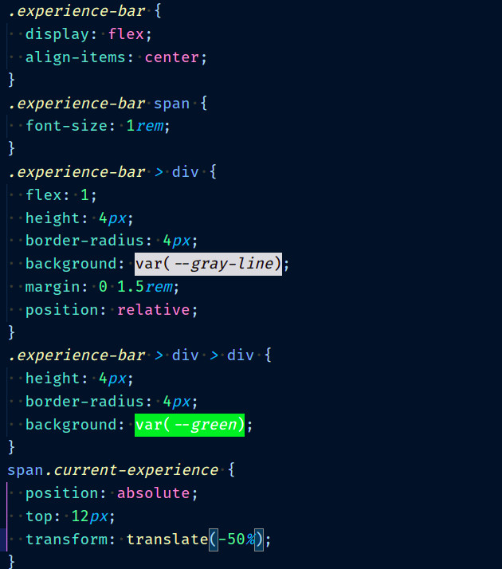
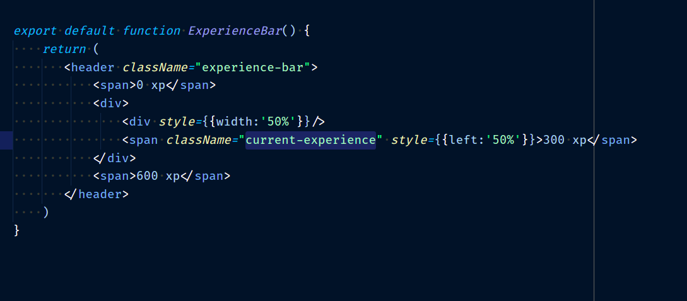

# NLW4 Moveit

<h1>Aula 1</h1>
<h2>Introdução</h2>

Moveit é um aplicativo que tem como estratégia fazer com que você não fique parado por muito tempo.
A tecnica de Pomodoro diz que a cada 25 minutos se deveria dar uma pausa pequena de 5 minutos para ter melhor desempenho, o que está totalmente alinhado com a proposta do Moveit!

Nesta documentação vou escrevendo os aprendzados e impressões de cada aula , assim como mostrar exemplos de cada nova funcionabilidade. Assim, conseguirei ter um material de consulta para projetos futuros e disponibilizarei esse repositório como público para que outros devs possam utilizá-lo para consulta também.

<h2>Fluxo de uma API</h2>

<h2>Criando projeto React</h2>
<ul>
<li>
Comando para criar um projeto react pelo <strong>YARN</strong> e com <strong>TYPESCRIPT</strong> é :  
</li>
 

<strong>yarn create react-app NomeDoProjeto --template=typescript</strong>

<li>
Comando para criar um projeto react pelo <strong>NPM</strong> e com <strong>TYPESCRIPT</strong> é :  
</li>
 

<strong>npx create react-app NomeDoProjeto --template=typescript</strong>

</ul>
<h3>Rodando projeto React</h3>
<ul>
<li>
Comando para rodar projeto react pelo <strong>YARN</strong> é :  
</li>
 

<strong>yarn start</strong>

<li>
Comando para rodar projeto react pelo <strong>NPM</strong> é :  
</li>
 

<strong>npm start</strong>

</ul>
<h3>Como react funciona?</h3>

Uma vez carregado o basico da pagina pelo HTML o React pega os dados e criar outros componentes HTML utiizando <strong>Javascript</strong>. A sintaxe de se utilizar um componente JS parecendo um HTML é o <strong>JSX</strong>.

<h2>Componentes</h2>

São as "Tags HTML" do react. Com  elas por meio do REACT DOM o react consegue criar componentes HTML.Pode se dizer que tudo no react são componentes. Para se criar um componente, deve-se criar uma função e exporta-la como default de seu arquivo. Reutilize os componentes em vários lugares, isso ajuda muito em manutenção e para diminuir a quantidade de codigo da aplicação.

<h3>Propriedades(Props)</h3>

são as caracteristicas de cada componente que podem ser enviadas do componente pai que os chama. São passadas via parametro na função do componentes como mostram as imagens abaixo.

<h3>Children</h3>

Declaração de props default do react que surge quando se passa um parâmetro dentro de um componente. Por padrão , quando isso ocorre se pode pegar esses parâmetros dentro de <strong>props.children</strong>.

<h2>Estado</h2>

É a "memória" de um componente. Quando um componente precisa guardar dados e propriedades dinâmicas sobre si mesmo, é necessário utilizar estado. 

<h3>Manipular estado(HOOKS)</h3>
<h4>useState</h4>

É o como fazemos para mudar o estado de um componente. No exemplo abaixo fizemos um contador e uma função que utiliza do usestate para atualizar o valor de counter. Caso haja mais de uma propriedade que se deseja mudar, pode-se utilizar um objeto no lugar do numero  counter e colocar varias propriedades modificando somente as propriedades desse objeto que se deseja.

<h2>Fontes</h2>

Para utilizar fontes do goolge entramos no site de google fonts e procuramos pelas fontes Inter de tamanho 400, 500 e 600 e a fonte Rajdhani de tamanho 600. Uma vez adicionados pegamos o link gerado na pagina e colamos em index.html.

<h2>CSS global</h2>

Criamos uma pasta chamada styles e dentro um arquivo css onde setamos alguns parametros globais para nossa aplicação. Dentre eles estava que todos os componentes teriam margem e padding 0 por default e que a cor de fundo do nosso body seria #f2f3f5

<h2>Responsividade</h2>

para responsividade, setamos o padrão da fonte da nossa aplicação para 1rem (16 px por padrão), e colocamos @medias para que quando nossas telas diminuam de tamanho, as fontes se adaptem diminuindo 1px. Quando utilizamos rem , quando o tamanho da tela diminui , todos os componentes diminuem junto, fazendo assim com que nosso app seja extremamente responsivo.

<h2>Experience Bar</h2>

Criamos o experience bar utilizando css e o componente da experience bar.

